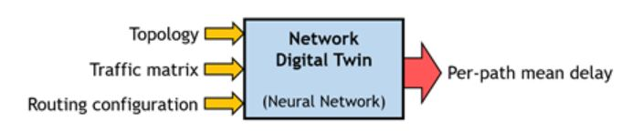
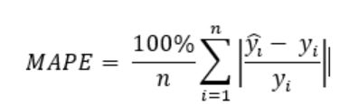
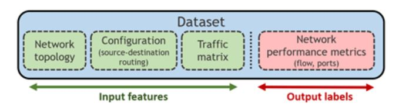

# ITU-ML5G-PS-001 Graph Neural Networking Challenge 2021 - Creating a Scalable Network Digital Twin
The challenge information can also be accessed on this website: https://bnn.upc.edu/challenge/gnnet2021/
## Description
Please, note that it is mandatory filling the registration form before the deadline (Aug 31st) to officially participate in this challenge:
https://bnn.upc.edu/challenge/gnnet2021/registration

Overview:
Graph Neural Networks (GNN) have produced ground-breaking applications in many fields where data is fundamentally structured as graphs (e.g. chemistry, physics, biology, recommender systems). In the field of data networks, this new type of neural networks is being rapidly adopted for a wide variety of use cases, particularly for those involving complex graphs (e.g. performance modelling, routing optimization, resource allocation in wireless networks) [1].

The Graph Neural Networking 2021 problem statement brings a fundamental limitation of existing GNNs: their lack of generalization capability to larger graphs. In order to achieve production-ready GNN-based solutions, we need models that can be trained in network testbeds of limited size, and then be able to operate with guarantees in real customer networks, which are often much larger in number of nodes. In this challenge, participants are asked to design GNN-based models that can be trained in networks of limited size (up to 50 nodes), and then generalize successfully to larger networks not seen before, up to 300 nodes. Solutions with better scalability properties will be the winners.

Problem statement:
The goal of this challenge is to create a Network Digital Twin solution based on neural networks, which can accurately estimate QoS performance metrics given a network state snapshot. More in detail, this solution must predict the resulting source-destination mean per-packet delay given: (i) a network topology, (ii) a source-destination traffic matrix, and (iii) a network configuration (routing):

Figure 1: Schematic representation of the neural network-based solution targeted in this challenge

Particularly, the objective of this challenge is to achieve a Network Digital twin that can effectively scale to considerably larger networks than those seen during the training phase.

Baseline:
As a baseline, we provide RouteNet [2], a Graph Neural Network (GNN) architecture recently proposed to estimate end-to-end performance metrics in networks (e.g. delay, jitter, loss). Thanks to its GNN architecture, RouteNet revealed an unprecedented ability to make accurate performance predictions even in network scenarios unseen during the training phase, including other network topologies, routing configurations, and traffic matrices.
In this challenge, we extend the problem to modelling performance in networks considerably larger to those seen in the training phase. When RouteNet is trained in small-scale networks, such as those of the training dataset of this challenge, it is not able to produce accurate estimates in much larger networks, as those of the validation and test datasets. As a result, we need a model that offers better scalability properties. Nowadays, achieving scalable GNN models is a relevant open problem in the Machine Learning community.
Participants are encouraged to update RouteNet or design their own neural network architecture from scratch.

Check more details at:
https://bnn.upc.edu/challenge/gnnet2021
## Evaluation criteria

The objective is to test the scalability properties of proposed solutions. To this end, before the end of the challenge, we will provide a test dataset. This dataset will contain samples with similar distributions to the samples present in the validation dataset. Participants must label this dataset with their neural network models and send the results in CSV format. For the evaluation, we will use the Mean Absolute Percentage Error (MAPE) score computed over the delay predictions produced by candidate solutions:

Solutions with lower MAPE score will be the winners.

Please, note that it is mandatory filling the registration form before the deadline (Aug 31st) to officially participate in this challenge:
https://bnn.upc.edu/challenge/gnnet2021/registration

### General
- Registration and submission deadlines are given in the Timeline tab.
- Registration and submission will take place on the ITU AI for Good Challenge Portal. Submissions can also be made through Google Forms as described [here](https://github.com/Xilinx/brevitas-radioml-challenge-21/discussions/18) if there are issues with the ITU Portal.
- Teams can consist of up to 4 individuals.
-  Submissions will be evaluated and ranked after the submission period closes.
- Valid submissions (see Criteria for Valid Submissions) will be ranked in ascending value (lower is better) of the inference cost score (see Inference Cost).

## Data source
We provide a dataset generated with the OMNet++ network simulator, which is a discrete event packet-level network simulator. The dataset contains samples simulated in several topologies and includes hundreds of routing configurations and traffic matrices. Each sample is labelled with network performance metrics obtained by the simulator: per-flow performance statistics (mean per-packet delay, jitter and loss), and port statistics (e.g. queue utilization, size).

Data is divided in three different sets for training, validation and test. As the challenge is focused on scalability, the validation dataset contains samples of networks considerably larger (51-300 nodes) than those of the training dataset (25-50 nodes). Likewise, the test dataset will be released at the end of the challenge, just before the evaluation phase starts, and it will contain samples following the same distribution as in the validation dataset.

Please, find a detailed description of the datasets and the links to download them here:
https://bnn.upc.edu/challenge/gnnet2021/dataset

## Resources
All the tools and resources can be found at the following link:
https://bnn.upc.edu/challenge/gnnet2021

- Datasets: Training, validation (released at the beginning) and test (unlabeled, released on Sep 15th)
- Python API to easily read the datasets provided
- RouteNet: baseline GNN-based Digital Twin (open-source implementations in TensorFlow and IGNNITION [3])
- Mailing list for questions and comments related to the challenge [link](https://mail.bnn.upc.edu/cgi-bin/mailman/listinfo/challenge2021)

- Summary slides describing the challenge

## Rules
This challenge is open to all participants. To participate officially, it is mandatory filling the registration form (before Aug 31st) at:

https://bnn.upc.edu/challenge/gnnet2021/registration

Please, find the specific rules of this problem statement at the website:
https://bnn.upc.edu/challenge/gnnet2021
## References for further reading
[1] Must-read papers on GNN for communication networks. https://github.com/BNN-UPC/GNNPapersCommNets\
[2] Rusek, K., Suárez-Varela, J., Mestres, A., Barlet-Ros, P., & Cabellos-Aparicio, A, “Unveiling the potential of Graph Neural Networks for network modelling and optimization in SDN,” In Proceedings of ACM SOSR, pp. 140-151, 2019.\
[3] IGNNITION: Framework for fast prototyping of Graph Neural Networks for communication networks. https://ignnition.net/

## Results
1. PARANA
2. SOFGNN
3. ZTE AIOps
4. EricRe
5. GAIN
6. LARRENIE
7. Salzburg research
8. GraphNet
9. Saankhya labs
10. penguinGNN
11. OptiMANET
12. C-DAC(T)
