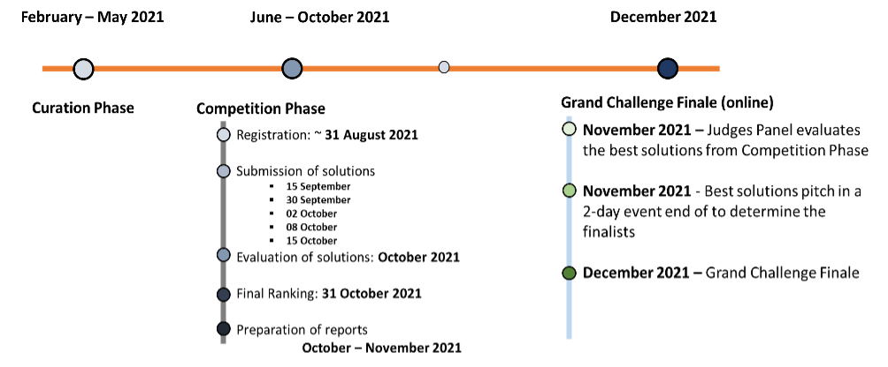
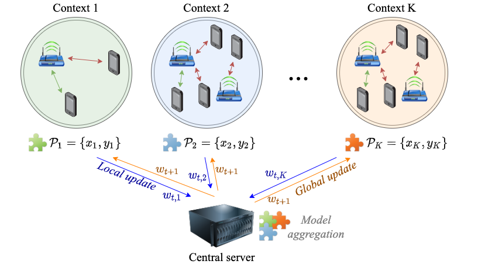

# ITU-ML5G-PS-004: Federated Learning for Spatial Reuse in a multi-BSS (Basic Service Set) scenario

## Description
[NOTE: The following information can also be found at https://www.upf.edu/web/wnrg/2021-edition]

1. Presentation

This problem statement is framed into the Networks-track because it gives rise to developing ML models based on a training dataset that will be provided to participants.

[Video](https://aiforgood.itu.int/event/unleashing-the-potential-of-machine-learning-to-address-spatial-reuse-in-future-ieee-802-11-wlans-an-introduction-to-two-problem-statements-for-the-itu-ai-challenge/) Presentation of the IEEE 802.11ax SR topic and introduction to the problem statement.

Congratulations to the finalists!

RANK TEAM MAE (Mbps)
1 FedIPC 5.8572
2 FederationS 6.5534
3 WirelessAI 8.913

## 1.1 Timeline

During the competition phase, participants will have to develop and train an FL model for this problem statement (deadline, 25/10/2021), whose accuracy will be measured on a test data set containing unseen labeled examples (results will be published on 31/10/2021). Then, provided that participants succeed in providing a valid FL model for this problem statement, they will have to prepare a report explaining their solution (deadline, November 2021). Based on this report, the AI Challenge judges will decide which teams will participate in the grand challenge finale in December 2021.

Timeline of the challenge:

Registration deadline (see section 1.2) - 31/08/2021 14/09/2021 (Closed)
Setup the environment (Tensorflow Federated Learning) and start playing with last year’s data set (see section 3.1) - Available now
Publication of the training data set - Available now
Publication of the test data set - Available now
Competition phase - September to October
Submission of solutions - 29/10/2021 (Closed)
Final ranking & Publication of the entire test data set (with labels) - Available now
Grand challenge finale - December 2021

1.2 Registration

 You can register before at https://challenge.aiforgood.itu.int/
The steps you need to follow are:
1. Participants should register at the official website
2. Choose the problem statement to work on [ITU-ML5G-PS-004].
3. Choose a team leader who will “create the team [e.g., FedSirs]” under the problem statement [ITU-ML5G-PS-004]
4. Admin will approve the team creation
5. Team members request to join the team [​FedSirs]
6. A team leader should approve the request to join the team.​

1.3 Prizes

Among the prizes are 5,000 CHF for 1st prize, 3,000 CHF for 2nd prize, 2,000 CHF for 3rd prize, internship(s) and a guest researcher position, and various certificates.

## 2. Background

## 2.1 IEEE 802.11ax Spatial Reuse

The Spatial Reuse (SR) operation was firstly introduced in the IEEE 802.11ax (11ax) amendment [1] as a novel feature to improve spectral efficiency. SR allows Wi-Fi devices to identify transmission opportunities (TXOPs) even if noticing high interference, thus potentially increasing the number of parallel transmissions in an Overlapping Basic Service Set (OBSS). To accomplish that, SR uses Clear Channel Assessment (CCA) adjustment along with transmission power control. Several works have studied the potential gains of SR in the context of 11ax [1] [2] [3] [4]. However, the potential gains of SR are limited by the rigidity of the mechanism introduced in the 11ax, which is too conservative and only considers local information. As a result, the definition of efficient policies for addressing SR remains open.

To address the SR problem in 11ax WLANs, we propose using Machine Learning (ML). ML allows capturing subtle information that cannot be predicted beforehand (for instance, regarding inter-BSS interactions). Such information enables conducting a learning-based procedure aimed at increasing performance while reducing the number of undesired situations (e.g. poor fairness).

## 2.2 Federated Learning

In Federated Learning (FL) [5], a typically large number of clients or learners (from tens to millions) collaborates, each one using unshared local data, to train a global shared model (e.g., a supervised learning task). This is done by allowing clients to exchange model parameters, which are iteratively updated until convergence. In traditional FL settings, all this operation is orchestrated by a central server, which gathers all the local updates and returns an aggregated global model.

In the context of this problem statement, we ask for Federated Learning (FL) proposals, so that participants are expected to build a model that can be trained by different distributed clients or devices.

## Evaluation criteria

Solutions with lower MAPE and RMSE score for Task 2 and high probability in % of recognition in Task 1 will be the winners.
The output format is the report (expected) which include the following:
Problem analysis include the Gap analysis of current approaches for solve defined research problem (~2 pages);

1. Architectural scheme, models, algorithm in UML notation
(~1 page);
2. Description of solution/suggestion (~1 page);
3. Results of modelling in the graphs and their explanation
(~ 1-2 pages);
4. Source software with ML and Big data (if necessary) algorithms;
Trained ML-models;
5. Results in the CSV file, which contains results of training: necessary parameters (MAPE & RSME, Probability).
*the “.docx” format is required for report.
About Us

## Data source
## 3. Dataset and Resources

3.1 IEEE 802.11ax SR data set

A dataset generated with the Komondor simulator [6] is provided to train FL models with (preferably) TensorFlow. You can access the dataset at [Zenodo](https://zenodo.org/record/5352060#.YS9cc9Mzba0).

The dataset consists of a set of files with measurements from 11ax SR devices in different contexts. A context is a Wi-Fi deployment with specific characteristics, such as nodes location, number of interfering BSSs, Access Point (AP) load, etc. For each device (or client), we provide several combinations of 11ax OBSS/PD values, so that the model parameters can be jointly optimized with local data.

IMPORTANT CLARIFICATION: for each deployment, we focus on BSS A (the first BSS). Throughput and other information is provided for AP_A and its associated STAs only. Moreover, only this BSS is allowed to modify the OBSS/PD threshold across the different simulation files. The rest of BSSs use the default OBSS/PD = -82 dBm, for the sake of reducing complexity.

In particular, we provide three training files, where the results for 3,000 different contexts are provided, and each context is simulated for each possible OBSS/PD-based threshold (from -82 dBm to -62 dBm in 1 dBm steps). Notice, as well, that the contexts of Scenario 3 also include different STA locations.

Two different scenarios are considered in the dataset:

Scenario 1: 1,000 different deployments with 2-6 APs and 1 STA per AP. A minimum distance limitation is applied, so that each AP different from AP_A is located at a minimum distance of 10 meters from that one. Two files are considered: (1) “output_11ax_sr_simulations_sce1.txt”: contains the output generated by the simulator for the deployments in Scenario 1, (2) “simulator_input_files_sce1.zip”: contains the input files used by the simulator to simulate the deployments in Scenario 1.
Scenario 2: 1,000 different deployments with 2-6 APs and 1-4 STAs per AP. No distance limitation is applied. Two files are considered: (1) “output_11ax_sr_simulations_sce2.txt”: contains the output generated by the simulator for the deployments in Scenario 2, (2) “simulator_input_files_sce2.zip”: contains the input files used by the simulator to simulate the deployments in Scenario 2.
Scenario 3: 1,000 different deployments with 2-6 APs and 1-4 STAs per AP. No distance limitation is applied. Up to 20 different locations for STAs in BSS_A are considered for each context. Two files are considered: (1) “output_11ax_sr_simulations_sce3.txt”: contains the output generated by the simulator for the deployments in Scenario 3, (2) “simulator_input_files_sce3.zip”: contains the input files used by the simulator to simulate the deployments in Scenario 3.
The training files include the information of each simulation as follows:

Header line, indicating the name of the input file used for the simulation (the name of the input file contains the OBSS/PD-based threshold used in each case)
Array with the throughput (in Mbps) obtained by each STA of the BSS of interest
Array with the interference (in dBm) sensed by the AP of interest, from all the other APs.
Array with the RSSI (in dBm) received by each STA of the BSS of interest, from its corresponding AP.
Array with the average SINR (in dB) experienced by each STA of the BSS of interest.
Lines 1-5 are repeated for each simulated context and configuration (for instance, in Scenario 1, in total, there are 21 x 1,000 = 21,000 simulated deployments).

Below, you can find a fragment of the training file, for a single simulated context with a configuration of OBSS/PD = -71 dBm (as indicated in the header line):

KOMONDOR SIMULATION ‘sim_input_nodes_m2_s275_c-71.csv’ (seed 1991)
12.06,16.19,16.32,17.19,11.42\
-119.48\
-59.26,-57.95,-58.24,-55.99,-61.58\
35.71,37.04,36.75,39.01,33.42

Besides the simulation’s output, we provide the input files used by the simulator, from which participants can extract further information (e.g., exact nodes’ location). Input files are individual .csv files containing the parameters used by the simulator in each simulation. Notice, as well, that all the simulation results are gathered in a single file.

THE EVALUATION files are collected in the TEST DATASET (output_11ax_sr_simulations_test.txt). In the test dataset, the throughput values (i.e., the label to be predicted) have been set to 0.

## 3.2 Federated Learning resources

Participants are encouraged to use the TensorFlow FL libraries (available [here](https://www.tensorflow.org/federated)), but other FL solutions are accepted (e.g., Pytorch, custom solutions).\

To install TensorFlow Federated (TFF), please refer to this [website](https://www.tensorflow.org/federated/install?hl=en). A  useful video tutorial on TFF can be found [here](https://www.youtube.com/watch?v=m17IgaHaoTI).

To implement an FL algorithm, the following steps are recommended:

Process the dataset and extract the features of interest (e.g., interference, RSSI, SINR).

Split data from different contexts (i.e., simulation scenarios) to make it suitable for FL training. Notice that each context has been simulated with different OBSS/PD thresholds and that all the tried combinations correspond to a single FL “client”. In other words, training must be split for each simulated scenario, each one with a unique identifier that is indicated in the header line (or in the input file name). For instance, ‘sim_input_nodes_m2_s275_c-71.csv’ corresponds to scenario ‘275’, and in this case, the selected configuration is -71 dBm.

Train the FL algorithm by aggregating the model updates provided by each context, which perform local training functions.

## 4. Submission guidelines

This problem statement is divided into three different deliverables:

Deliverable 1 (29 October 2021): a trained FL model that selects the best configuration in IEEE 802.11ax SR deployments.
In this deliverable, participants need to submit a .txt or .csv file with the predictions done by their model on the contexts in the test dataset. The test dataset includes 1,000 different new deployments, and the throughput (label) has been set to 0.

In particular, the submitted solutions will be evaluated using the Mean Average Error (MAE), comparing the predicted values with the actual ones.

Deliverable 2 (November 2021): a written report explaining the proposed FL model, as well as the technical details regarding pre-processing, training, validation, etc.
Deliverable 3 (December 2021): A presentation in the grand challenge finale.
[More details will be provided soon regarding the format of each deliverable]

## 5. References

[1] Wilhelmi, F., Barrachina-Muñoz, S., Cano, C., Selinis, I., & Bellalta, B. (2021). Spatial reuse in IEEE 802.11 ax WLANs. Computer Communications, 170, 65-83. [Open-access version].

[2] Wilhelmi, F., Barrachina-Muñoz, S., & Bellalta, B. (2019, October). On the performance of the spatial reuse operation in IEEE 802.11 ax WLANs. In 2019 IEEE Conference on Standards for Communications and Networking (CSCN) (pp. 1-6). IEEE. [Open-access version].

[3] Rodrigues, E. D. C., Garcia-Rodriguez, A., Giordano, L. G., & Geraci, G. (2020). On the Latency of IEEE 802.11 ax WLANs with Parameterized Spatial Reuse. arXiv preprint arXiv:2008.07482.

[4] Krotov, A., Kiryanov, A., & Khorov, E. (2020). Rate Control With Spatial Reuse for Wi-Fi 6 Dense Deployments. IEEE Access, 8, 168898-168909.

[5] Konečný, J., McMahan, H. B., Yu, F. X., Richtárik, P., Suresh, A. T., & Bacon, D. (2016). Federated learning: Strategies for improving communication efficiency. arXiv preprint arXiv:1610.05492.

[6] Barrachina-Muñoz, S., Wilhelmi, F., Selinis, I., & Bellalta, B. (2019, April). Komondor: a wireless network simulator for next-generation high-density WLANs. In 2019 Wireless Days (WD) (pp. 1-8). IEEE. [Open-access version].

6. Contact

Francesc Wilhelmi (fwilhelmi@cttc.cat)

Boris Bellalta (boris.bellalta@upf.edu)

ITU AI Challenge committee (ai5gchallenge@itu.int​​)

## Results
1. ghazalrn
2. IUST

