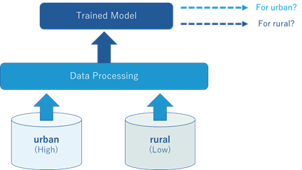
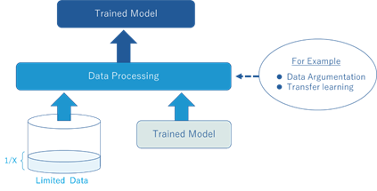

# ITU-ML5G-PS-015: Network failure detection and root cause analysis in 5GC by NFV-based test environment.

## Description
As 5G mobile networks are getting to be spread globally, the stable and high-quality operation is a must to minimize the social impact caused by 5G service failure. In conjunction with 5G deployment, not only NFV (network function virtualization) but also CNF (cloud native function) is being deployed in service provider networks, adding complexity and uncertainty to operational environment. In that situation, network automation is a key to accelerate 5G network penetration, although highly experienced operators can tackle affected network failure and the anomaly detection is additionally desired to be automatically and rapidly performed by AI/ML.
In this problem, the data sets in a 5G core network are provided along with network status information such as normal, interface-down, memory-stress and so forth, as normal/abnormal labels. Participants are required to create the model to pinpoint the network status of failures using those data sets and evaluate the performance of the developed model. In order to align to the real operational environment, we provide the data sets in cases of low and high volume of calls assuming urban and rural environments (Fig. 1). In Problem #1, participants are asked to consider the separate trained model for the urban area using rural data, and vice versa.
In addition to this, we provide very limited data set in case of middle environment for training (Fig. 2). In Problem #2, the participants are requested to create the model under this condition, for example, by intentionally generated complimentary data set, or by borrowing the data model in Fig. 1.

### Fig. 1.

### Fig. 2.

## Evaluation criteria

Participants must submit the presentation file containing the demonstration video in order to indicate the solution of the problem and the evaluated results of the solution. The evaluation must be done by an appropriate method for used AI/ML.

## Data source
The data sets used for this challenge were created in the NFV-based test environment simulated for 5GC according to [1]. In this sense, they are synthetic data, but as similar as the real data, resulting from our NFV-based test environment.
The data sets consist of normal/abnormal labels, performance monitoring data sets such as traffic volume, various information of a control plane, HW and middleware performance data. Whilst the data sets were kept to be stored for a long period enough to be analysed, intentional network failures were applied to the network, leading to abnormal labels.

The provided data set consists of 01 and 02 directory for problem #1, #2 respectively. Both training and test data are located in each directory with label and performance information. The falilure-label-a/b/c directory contains label data (a: urban, b: middle, c: rural). The network-5gc-a/b/c directory contains performance data for each area.

## Resources
Participants must prepare for their own computing environment. Utilized tools are desired to be open source software (OSS)-based in order for other people to conduct additional experiments.

## Results
1. YOTA-YOTA
2. Kaien
3. Team Fukui

